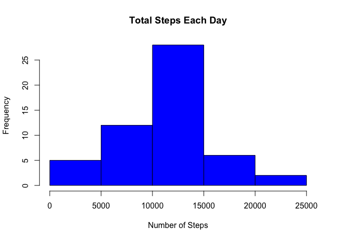
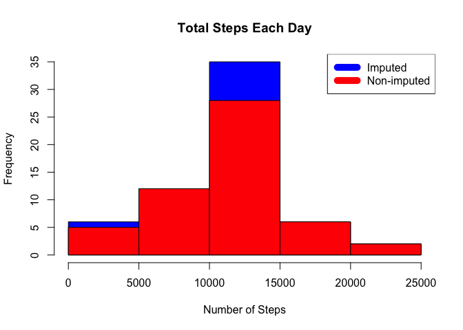
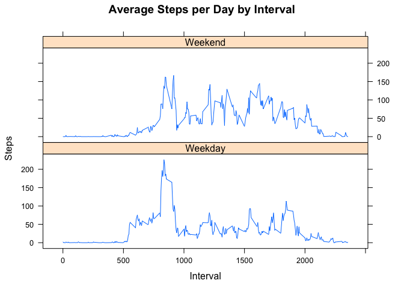

Steps Analysis
==========================================================

###Introduction
This program will take in step counting data collected from a device similar to the a fitbit. The program will
1. Determine and present the mean total daily step counts
2. Show if there are daily patterns in steps taken
3. Compare weekday to weekend step counts

The program will also need to deal with missing data (**NA**s)

###Part 1: Reading in and cleaning data from csv file
First, we read in the data, found [here][1] (downloads a zip file).


```r
data <- read.csv("activity.csv", header = TRUE)
str(df)
```

```
## function (x, df1, df2, ncp, log = FALSE)
```

The structure of the dataframe indicates there are over 17,000 observations, and we are told that at each time interval of five minutes the date and the number of steps. 

###Part 2: Finding Mean and Median Daily Ammounts
Next, we aggregate the data by date and find the mean and median. A histogram is also provided.


```r
steps_by_day <- aggregate(steps ~ date, data, sum)
hist(steps_by_day$steps, main = paste("Total Steps Each Day"), col="blue", xlab="Number of Steps")
```

<!-- -->

```r
rmean <- mean(steps_by_day$steps)
rmedian <- median(steps_by_day$steps)
```

###Part 3: Finding Mean and Median Steps by Interval
With the data, we also care about trends within a day, so we look at the steps taken in smaller intervals than a day. 


```r
steps_by_interval <- aggregate(steps ~ interval, data, mean)

plot(steps_by_interval$interval,steps_by_interval$steps, type="l", xlab="Interval", ylab="Number of Steps",main="Average Number of Steps per Day by Interval")
```

<!-- -->

```r
max_interval <- steps_by_interval[which.max(steps_by_interval$steps),1]
```

This data has time intervals of 5 minutes.


###Part 4: Missing Data Points
The original data has numerous missing points (NAs), so we need to know what that means.


```r
incomplete <- sum(!complete.cases(data))
imputed_data <- transform(data, steps = ifelse(is.na(data$steps), steps_by_interval$steps[match(data$interval, steps_by_interval$interval)], data$steps))
```


NAs are assumed to be zeroes.


```r
imputed_data[as.character(imputed_data$date) == "2012-10-01", 1] <- 0
```


And then, we recount with the cleaned-up data and create a new hisogram.


```r
steps_by_day_i <- aggregate(steps ~ date, imputed_data, sum)
hist(steps_by_day_i$steps, main = paste("Total Steps Each Day"), col="blue", xlab="Number of Steps")

#Create Histogram to show difference. 
hist(steps_by_day$steps, main = paste("Total Steps Each Day"), col="red", xlab="Number of Steps", add=T)
legend("topright", c("Imputed", "Non-imputed"), col=c("blue", "red"), lwd=10)
```

<!-- -->

Now, we find the new mean and median and see how much it differs from our previous work.


```r
rmean.i <- mean(steps_by_day_i$steps)
rmedian.i <- median(steps_by_day_i$steps)

mean_diff <- rmean.i - rmean
med_diff <- rmedian.i - rmedian
```

Now, we calculate the total difference.


```r
total_diff <- sum(steps_by_day_i$steps) - sum(steps_by_day$steps)
```

###Part 5: Weekdays vs. Weekends
Finally, we look to see if there is a difference in trends for weekdays compared to weekends.


```r
weekdays <- c("Monday", "Tuesday", "Wednesday", "Thursday", 
              "Friday")
imputed_data$dow = as.factor(ifelse(is.element(weekdays(as.Date(imputed_data$date)),weekdays), "Weekday", "Weekend"))

steps_by_interval_i <- aggregate(steps ~ interval + dow, imputed_data, mean)

library(lattice)

xyplot(steps_by_interval_i$steps ~ steps_by_interval_i$interval|steps_by_interval_i$dow, main="Average Steps per Day by Interval",xlab="Interval", ylab="Steps",layout=c(1,2), type="l")
```

<!-- -->

Notice the peak of activity on the weekdays, but overall there appears to be more movement on weekends. Looks like someone has a desk job.
